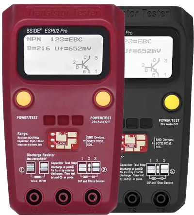

# BSide ESR02 firmware

This repository has been created to maintain the firmware configuration of the BSide ESR02 as the ComponentTester project versions change.

**This is not an official repository**: I created this repository to make life easier for people (and myself) wishing to update the firmware
of their device by centralizing the information for this particular model in this repository.

The source of this repository is [Transistortester-Warehouse](https://github.com/madires/Transistortester-Warehouse)

## Instructions

### 1. Get the binaries

### From the downloaded firmware

You can download directly the firmware files from the [releases](https://github.com/hugokernel/BSide_ESR02_Firmware/releases) from the Github project page.

### By compiling yourself the sources

For GNU/Linux and specifically on an Debian related OS, you need to install the following packages:

- `gcc-avr`
- `binutils-avr`
- `avr-libc`
- `gdb-avr`

Then, go to the `firmware` directory and enter the command: `make`.

### 2. Upload the binaries to the target

Make sure you have the package `avrdude`, then you can use the command `make upload`.

Or use directly the following command:

`avrdude -c usbasp -p atmega328p -F -U lfuse:w:0xCE:m -U hfuse:w:0xDF:m -U efuse:w:0xFF:m -U flash:w:ComponentTester.hex:i -U eeprom:w:ComponentTester.eep:a`

Note: By default, the `make upload` command try to use the `avrispmkII` programmer, if you want to use another one,
you have to edit the `Makefile` and change the ISP Programmer.

## TODO

- Explain how to find the ISP header
- Update to the latest version...
